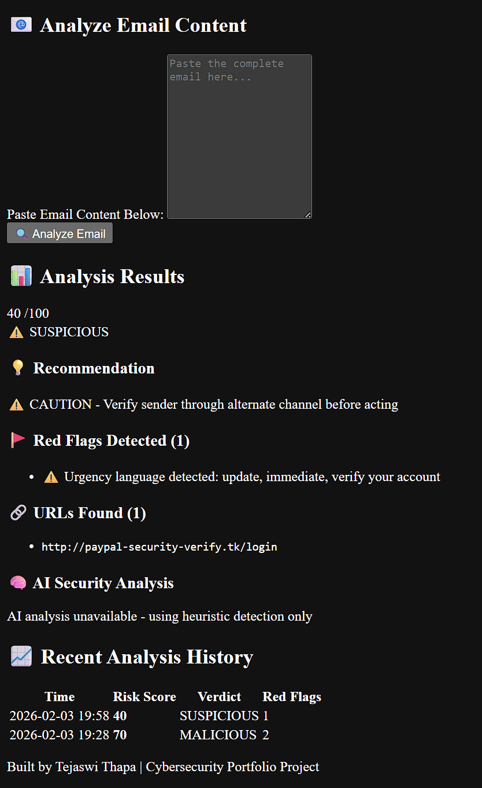

# 🛡️ PhishGuard AI - Intelligent Phishing Detection System

An AI-powered cybersecurity tool that analyzes emails for phishing attempts using machine learning, threat intelligence databases, and behavioral analysis.

## 🎯 Features

- **🔍 Multi-Layer Detection**
  - URL reputation checking via URLhaus threat database
  - AI-powered social engineering detection using OpenAI GPT
  - Heuristic analysis for suspicious patterns and urgency tactics
  
- **📊 Real-Time Analysis**
  - Instant risk scoring (0-100 scale)
  - Detailed breakdown of red flags and threats
  - Visual dashboard with risk level indicators

- **🗄️ Threat Intelligence**
  - Integration with URLhaus malware database
  - Detection of suspicious TLDs and IP-based URLs
  - Pattern matching for common phishing techniques

- **💾 Analysis History**
  - SQLite database for tracking past analyses
  - Historical risk trends and statistics
  - Recent analysis overview

## 🛠️ Tech Stack

- **Backend:** Flask (Python)
- **AI/ML:** OpenAI GPT-3.5 Turbo
- **Threat Intel:** URLhaus API
- **Database:** SQLite with Flask-SQLAlchemy
- **Security:** Rate limiting, input validation
- **Frontend:** HTML5, CSS3, Responsive Design

## 🚀 Installation

1. **Clone the repository**
```bash
git clone https://github.com/TJ-CyberSec/PhishGuard-AI.git
cd PhishGuard-AI
```

2. **Create virtual environment**
```bash
python -m venv venv
source venv/bin/activate  # On Windows: venv\Scripts\activate
```

3. **Install dependencies**
```bash
pip install -r requirements.txt
```

4. **Configure environment variables**
```bash
cp .env.example .env
# Edit .env file and add your OpenAI API key
```

5. **Run the application**
```bash
python app.py
```

6. **Open browser to** `http://localhost:5000`

## 🔑 Configuration

Create a `.env` file in the project root with:
```env
OPENAI_API_KEY=your_openai_api_key_here
FLASK_SECRET_KEY=your_secret_key_here
```

**Get your OpenAI API key:** https://platform.openai.com/api-keys

## 📈 How It Works

### 1. **URL Analysis**
- Extracts all URLs from email content using regex
- Checks URLs against URLhaus malware database
- Analyzes URL characteristics (suspicious TLDs, IP addresses, length, special characters)

### 2. **Content Analysis**
- Detects urgency language and pressure tactics
- Identifies common phishing keywords
- Analyzes email tone and structure

### 3. **AI-Powered Detection**
- Uses GPT-3.5 to identify social engineering tactics
- Detects impersonation attempts
- Recognizes authority abuse and emotional manipulation

### 4. **Risk Scoring**
- Combines all signals into a 0-100 risk score
- Categorizes emails as: SAFE, SUSPICIOUS, or MALICIOUS
- Provides actionable recommendations

## 📊 Detection Capabilities

PhishGuard AI can detect:

- ✅ Malicious URLs from threat databases
- ✅ Suspicious domain characteristics (IP addresses, unusual TLDs)
- ✅ Urgency and pressure tactics
- ✅ Social engineering attempts
- ✅ Impersonation of legitimate organizations
- ✅ Credential harvesting attempts
- ✅ Authority abuse tactics

## 🎨 Screenshots

### Dashboard


### Analysis Results


## 🔒 Security Features

- **Rate Limiting:** Prevents API abuse (20 requests/minute)
- **Input Validation:** 10,000 character limit on email content
- **Environment Variables:** Secure API key storage
- **SQL Injection Protection:** Parameterized queries via SQLAlchemy

## 📝 Usage Example

1. Paste suspicious email content into the text area
2. Click "Analyze Email"
3. Review the risk score and detected red flags
4. Follow the provided recommendation

**Sample Output:**
```
Risk Score: 85/100
Risk Level: MALICIOUS
Red Flags:
  🚨 Malicious URL detected: http://phishing-site.tk (malware)
  ⚠️ Urgency language detected: urgent, verify now, expires
  🧠 AI detected social engineering: Authority, Fear
Recommendation: 🚨 DO NOT INTERACT - Delete immediately and report to IT
```

## 🧪 Testing

Test with sample phishing emails:
```python
# Example phishing email
sample_email = """
URGENT: Your account will be suspended in 24 hours!
Click here to verify: http://suspicious-link.tk/verify
"""
```

## 📚 Project Structure
```
PhishGuard-AI/
├── app.py                 # Flask web application
├── analyzer.py            # Core detection logic
├── requirements.txt       # Python dependencies
├── .env.example          # Environment variable template
├── .gitignore            # Git ignore rules
├── templates/
│   └── dashboard.html    # Web interface
├── static/
│   └── styles.css        # Styling
└── instance/
    └── phishing_analyzer.db  # SQLite database
```

## 🤝 Contributing

Contributions are welcome! Please feel free to submit a Pull Request.

1. Fork the repository
2. Create your feature branch (`git checkout -b feature/AmazingFeature`)
3. Commit your changes (`git commit -m 'Add some AmazingFeature'`)
4. Push to the branch (`git push origin feature/AmazingFeature`)
5. Open a Pull Request

## 📋 Future Enhancements

- [ ] Email header analysis (SPF, DKIM, DMARC)
- [ ] Integration with VirusTotal API
- [ ] Machine learning model training on labeled dataset
- [ ] Browser extension for real-time email scanning
- [ ] Multi-language support
- [ ] Export analysis reports (PDF, JSON)
- [ ] User authentication and team collaboration

## ⚠️ Disclaimer

This tool is for **educational and research purposes only**. Always verify suspicious emails through official channels. Do not paste emails containing:
- Personal information (SSN, credit cards, passwords)
- Confidential business data
- Sensitive financial information

## 📄 License

This project is licensed under the MIT License - see the [LICENSE](LICENSE) file for details.

## 👤 Author

**Tejaswi Thapa**
- GitHub: [@TJ-CyberSec](https://github.com/TJ-CyberSec)
- LinkedIn: [in/tj-cybersec](https://linkedin.com/in/tj-cybersec)
- Portfolio: Cybersecurity Student | Building Security Tools & Threat Intelligence Systems

## 🙏 Acknowledgments

- URLhaus by abuse.ch for threat intelligence data
- OpenAI for GPT API
- Flask community for excellent documentation
- Cybersecurity community for phishing research

## 📞 Support

If you have questions or need help:
- Open an issue on GitHub
- Email: gingaxmonster3060@gmail.com

---

⭐ **Star this repository if you found it helpful!**

Built with ❤️ for a safer internet